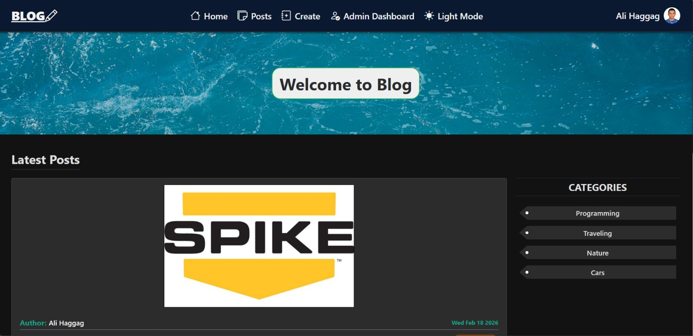

# 📝 Blog Pro - Professional Content Management System

> **Blog Pro** is a robust **Content Management System (CMS)** built with the MERN Stack. It features comprehensive role-based access control, real-time interactivity, and enterprise-grade security tailored for scalability.

[](https://Blog-Pro-Platform.vercel.app/)

## 🚀 Live Demo
[Click here to visit Blog Pro](http://localhost:3000)

---

## ✨ Key Features

### 1️⃣ Security & Performance (Backend) 🛡️
- **Secure Authentication:** Robust **JWT** implementation with HTTP-Only cookies and password complexity enforcement via **Joi**.
- **Protection Layers:** Integrated **Helmet** (Headers security), **XSS-Clean** (Sanitization), and **HPP** (Parameter Pollution protection).
- **Rate Limiting:** Advanced protection against brute-force attacks and spam.
- **Media Management:** Optimized cloud-based image storage using **Cloudinary**.

### 2️⃣ User Experience (Frontend) 👤
- **Interactive Community:** Nested comments system, real-time likes, and rich-text post creation.
- **Profile Management:** Complete control with avatar uploads and a dynamic **Follow/Unfollow system**.
- **Theme Customization:** Fully responsive UI with a built-in **Dark/Light Mode** toggle.

### 3️⃣ Admin Capabilities ⚡
- **Centralized Dashboard:** Full administrative control to manage Users, Posts, Categories, and Comments.
- **Analytics & Insights:** Visualized platform statistics and user growth tracking.
- **Role Management:** Strict role-based access control (RBAC) for Admins vs. Standard Users.

---

## 🛠️ Tech Stack

| Domain | Technologies |
| :--- | :--- |
| **Frontend** | React.js, Redux Toolkit, React Router, Bootstrap, **Toastify** |
| **Backend** | Node.js, Express.js, MongoDB (Mongoose) |
| **Security** | **Helmet**, **XSS-Clean**, Express-Mongo-Sanitize, BcryptJS |
| **Services** | **Cloudinary** (Storage), **Nodemailer** (Email Services) |

---

## 💻 Running Locally

1. **Clone the repository**
   ```bash
   git clone [https://github.com/Ali-Haggag7/blog-pro.git](https://github.com/Ali-Haggag7/blog-pro.git)
   cd blog-pro

2. **Install Dependencies**
```bash
# Install Backend Dependencies
  cd backend
  npm install

# Install Frontend Dependencies
  cd ../frontend
  npm install

```
3. **Environment Variables**
```bash
# Create a .env file in the backend directory and add your keys:
  PORT=8000
  MONGO_URI=your_mongodb_connection_string
  NODE_ENV=development
  JWT_SECRET=your_super_secret_key
  APP_EMAIL_ADDRESS=your_email@gmail.com
  APP_EMAIL_PASSWORD=your_app_password
  CLOUDINARY_CLOUD_NAME=your_cloud_name
  CLOUDINARY_API_KEY=your_api_key
  CLOUDINARY_API_SECRET=your_api_secret
  CLIENT_DOMAIN=http://localhost:3000

```
4. **Run the App**

```bash
# Run Backend (Open new terminal)
cd backend
npm run dev

```
```bash
# Run Frontend (Open separate terminal)
cd frontend
npm start

```
---

## 📄 License
This project is open source.
Created by Ali Haggag. © 2026 All rights reserved.
